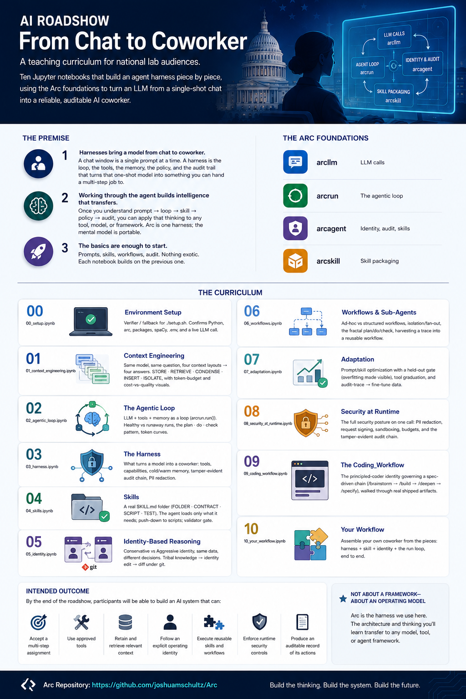

# AI-101-Fed — From Chat to Coworker

A teaching curriculum for national lab audiences. It pairs **eight slide decks**
with **eleven hands-on Jupyter notebooks** that build an agent harness piece by
piece — prompt → loop → skill → identity → policy → audit — on top of the
[Arc](https://github.com/joshuamschultz/Arc) foundations.



## The premise

1. **Harnesses bring a model from chat to coworker.** A chat window is one
   prompt at a time. A harness is the loop, the tools, the memory, the policy,
   and the audit trail that turns a one-shot model into something you can hand
   a multi-step job to.
2. **Working through the agent builds intelligence that transfers.** Once you
   understand prompt → loop → skill → policy → audit, you can apply that
   thinking to *any* tool, model, or framework. Arc is one harness; the mental
   model is portable.
3. **The basics are enough to start.** Prompts, skills, workflows, audit.
   Nothing exotic. Each module builds on the previous one.

## Curriculum

Each deck has a matching hands-on notebook. Lecture sets the concept; the
notebook makes it run.

| # | Deck | Notebook | What it teaches |
|---|---|---|---|
| 00 | — | `00_setup.ipynb` | Environment verifier / fallback for `setup.sh`. Confirms Python, Arc, packages, spaCy, `.env`, and a live LLM call. |
| 01 | `01_context_engineering.pptx` | `01_context_engineering.ipynb` | Same model, same question, four context layouts → four answers. STORE · RETRIEVE · CONDENSE · INSERT · ISOLATE, with token-budget and cost-vs-quality visuals. |
| 02 | `02_agentic_loop.pptx` | `02_agentic_loop.ipynb` | LLM + tools + memory as a loop (`arcrun.run()`). Healthy vs runaway runs, the plan · do · check pattern, token curves. |
| 03 | `03_harness.pptx` | `03_harness.ipynb` | What turns a model into a coworker: tools, capabilities, cold/warm memory, a tamper-evident audit chain, PII redaction. |
| 04 | `04_skills.pptx` | `04_skills.ipynb` | A real `SKILL.md` folder (FOLDER · CONTRACT · SCRIPT · TEST). The agent loads only what it needs; push-down to scripts; validator gate. |
| 05 | `05_identity.pptx` | `05_identity.ipynb` | Conservative vs Aggressive identity, same data, different decisions. Tribal knowledge → identity edit → diff under git. |
| 06 | `06_workflows.pptx` | `06_workflows.ipynb` | Ad-hoc vs structured workflows, isolation/fan-out, the fractal plan/do/check, harvesting a trace into a reusable workflow. |
| 07 | `07_adaptation.pptx` | `07_adaptation.ipynb` | Prompt/skill optimization with a held-out gate (overfitting made visible), tool graduation, and audit-trace → fine-tune data. |
| 08 | `08_mapping.pptx` + `08_mapping_workbook.xlsx` | `08_security_at_runtime.ipynb` | Mapping the concepts to your mission, plus the full security posture on one call: PII redaction, request signing, sandboxing, budgets, and the audit chain. |
| 09 | — | `09_coding_workflow.ipynb` | The principled-coder identity governing a spec-driven chain (brainstorm → build → deepen → specify), walked through real shipped artifacts. |
| 10 | — | `10_your_workflow.ipynb` | Assemble your own coworker from the pieces: harness + skill + identity + the `run` loop, end to end. |

## Repository layout

```
ai-101-fed/
├── 01_context_engineering.pptx … 08_mapping.pptx   # The eight lecture decks
├── 08_mapping_workbook.xlsx                         # Mission-mapping workbook (deck 08)
├── overview.png                                     # Course overview graphic
└── notebooks/                                        # The hands-on course (project root)
    ├── notebooks/      # Setup (00) + curriculum (01-10) Jupyter notebooks
    ├── data/           # Builders, fixtures, vendored spaCy NER model, incident corpus
    ├── skills/         # Example SKILL.md folders used by notebooks 04/05
    ├── identities/     # Identity files (conservative/aggressive, personas) for notebook 05
    ├── scripts/        # Docker entrypoint, run-docker helper, utilities
    ├── vendor/arc/     # Vendored static snapshot of Arc (Apache 2.0)
    ├── setup.sh        # One-shot env bootstrap (.venv + packages + kernel + .env)
    ├── Dockerfile      # Air-gapped / "run and dump" lab deployments
    ├── docker-compose.yml
    ├── Makefile
    ├── pyproject.toml  # uv-compatible; sources point at vendor/arc
    ├── requirements.txt
    └── README.md       # Deeper notes on the notebook course
```

> **Arc is vendored, not a submodule.** `notebooks/vendor/arc/` is a static
> snapshot of [github.com/joshuamschultz/Arc](https://github.com/joshuamschultz/Arc)
> (Apache 2.0, license included) so the course runs offline with no extra clone.

## Setup

The runnable course lives in `notebooks/`. From a clone:

```bash
git clone git@github.com:ctgfederal/ai-101-fed.git
cd ai-101-fed/notebooks
./setup.sh                       # creates .venv, installs everything, registers the kernel
# then edit .env and add: ANTHROPIC_API_KEY=sk-ant-...
.venv/bin/jupyter lab            # open a notebook, pick the "Arc venv" kernel
```

`./setup.sh` is idempotent and safe to re-run. It creates an isolated `.venv`,
installs everything in `requirements.txt` (jupyter, spaCy, matplotlib, tiktoken,
and the five Arc packages from `vendor/arc/`), loads the vendored spaCy NER
model, registers the **Arc venv** Jupyter kernel, and seeds `.env`.

No terminal? Open **`notebooks/00_setup.ipynb`** with the **Arc venv** kernel and
run it top-to-bottom — it does the same steps and smoke-tests a live LLM call.

**Prefer `uv`?** `uv sync` works out of the box — the `[tool.uv.sources]` paths
in `pyproject.toml` point at the vendored `vendor/arc/`.

## Air-gapped labs

For environments without external API access:

- **Arc is already vendored** at `notebooks/vendor/arc/` — no clone needed.
- The spaCy NER model is **vendored** at `notebooks/data/models/en_core_web_sm-3.8.0/`
  (~15 MB), so the PII-redaction notebook runs with zero network calls.
- Run [Ollama](https://ollama.com/) locally on the demo machine, set
  `OLLAMA_BASE_URL` in `.env`, and change `load_model("anthropic")` to
  `load_model("ollama", "llama3.1")` in each notebook.

The harness is identical. Only the brain changes.

## Docker ("run and dump")

For labs that discard the environment after use:

```bash
cd notebooks
./scripts/run-docker.sh          # start Jupyter Lab, persisting notebooks + data
./scripts/run-docker.sh dump     # copy all work to ./work-output/
./scripts/run-docker.sh clean    # tear down container and output
```

## License & attribution

Course materials © CTG Federal. The vendored Arc harness under
`notebooks/vendor/arc/` is licensed under the Apache License 2.0 — see
`notebooks/vendor/arc/LICENSE`.
