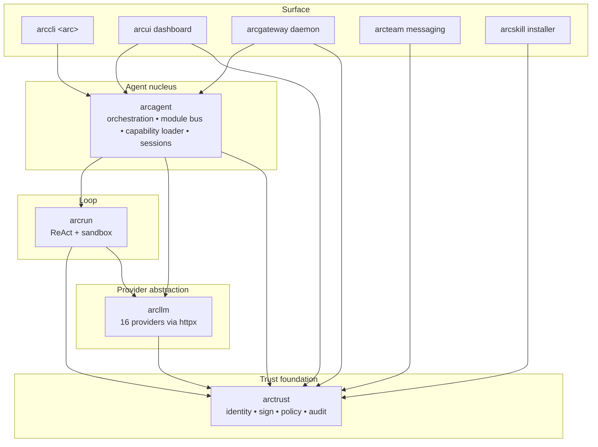

# Project Structure — Arc

> Stable architectural context that informs all feature specifications.
> Feature-specific directory maps go in `.claude/specs/{feature}/SDD.md`.

## Validation Checklist

- [x] Directory structure documented
- [x] Architecture pattern defined
- [x] Implementation boundaries set
- [x] Pattern references linked
- [x] Naming conventions documented
- [x] No `[NEEDS CLARIFICATION]` markers

---

## Directory Layout

```
arc/  (monorepo root)
├── packages/                      # 13 packages, layered dependency DAG
│   ├── arctrust/                  # LEAF — Identity, Sign, Authorize, Audit primitives
│   ├── arcllm/                    # 16 LLM providers via direct httpx
│   ├── arcrun/                    # Pure async ReAct loop + tool sandbox
│   ├── arcagent/                  # Agent nucleus — orchestrator
│   ├── arcskill/                  # Verified skill install (Sigstore+Rekor, AST scan)
│   ├── arcteam/                   # Multi-agent messaging + HMAC audit
│   ├── arcgateway/                # Telegram / Slack / Discord adapter daemon
│   ├── arcui/                     # Live WebSocket dashboard
│   ├── arccli/                    # `arc` CLI tool
│   ├── arcmas/                    # Meta-package (installs everything)
│   ├── arcmodel/                  # Model routing scaffolding (early)
│   ├── arcprompt/                 # Strategy prompts scaffolding (early)
│   └── arctui/                    # Terminal UI scaffolding (early)
│
├── demo-extensions/               # Reference implementations
│   ├── agent-template/            # Minimal scaffold for new users
│   ├── scap/                      # OpenSCAP / SCC XCCDF tools
│   ├── skill-scap/                # SCAP skill metadata + references
│   └── skill-knowledge/           # Knowledge-base skill scaffolding
│
├── demo/                          # Demo workflows + scripts
├── demo-data/                     # Synthetic SCAP scan data (4 hosts)
├── deploy/                        # AWS / container deployment configs
├── team/                          # Per-agent workspaces
│   ├── josh_agent/                # Dev / testing
│   ├── compliance_agent/         # CCRI compliance agent
│   ├── soc_agent/                 # SOC triage agent
│   ├── scap_isso_agent/           # ISSO-focused SCAP analysis
│   └── shared/                    # Shared capabilities + data
│
├── docs/                          # User-facing docs
│   ├── cli.md                     # Full `arc` CLI reference
│   └── architecture/              # Design docs, policy modules
│
├── architecture/                  # Architecture working notes
├── tests/                         # Top-level / cross-package tests
│   ├── architecture/              # TX.1 regression guards
│   └── e2e/                       # End-to-end demo scenario replays
│
├── .claude/                       # Internal planning + specs
│   ├── steering/                  # ← this directory (stable project context)
│   ├── adrs/                      # Accepted ADRs (ADR-017A..D currently)
│   ├── specs/                     # SPEC-001 … SPEC-025+ (per-feature)
│   ├── decisions-log.md           # Timestamped decision journal (D-001..D-NNN)
│   └── ...                        # builds, research, security, skills, worktrees
│
├── .github/workflows/             # CI: per-package publish-*.yml
├── scripts/                       # Coverage, LOC, verification utilities
├── CLAUDE.md                      # Canonical build standards + threat surface
├── README.md                      # Public product narrative
├── CHANGELOG.md                   # Version history
├── Makefile                       # Acceptance gates + dev targets
└── pyproject.toml                 # uv workspace + global ruff/mypy/pytest config
```

### Per-Package Layout (uniform across packages)

```
packages/<pkg>/
├── pyproject.toml                 # Hatchling build, package deps
├── README.md                      # Package-specific docs
├── src/<pkg>/                     # Source (PEP 621 src layout)
│   ├── __init__.py
│   ├── <module>.py
│   └── ...
└── tests/
    ├── unit/                      # Fast, isolated
    ├── integration/               # Cross-component
    ├── security/                  # Adversarial (where relevant)
    └── performance/               # Benchmarks (where relevant)
```

### `arcagent` — Nucleus Layout

```
packages/arcagent/src/arcagent/
├── core/                          # Nucleus — under LOC budget
│   ├── agent.py                   # ArcAgent + AgentHandle (DID required)
│   ├── module_bus.py              # Priority-ordered event bus with veto
│   ├── tool_registry.py           # 5-layer policy pipeline + dispatch
│   ├── config.py                  # TOML + Pydantic
│   ├── context_manager.py         # Compaction, observation masking
│   └── telemetry.py               # OTel integration (most primitives in arctrust)
│
├── modules/                       # Official optional modules (each independent)
│   ├── bio_memory/
│   ├── browser/
│   ├── delegate/                  # Spawn tool (agent delegation)
│   ├── memory/ + memory_acl/
│   ├── messaging/
│   ├── planning/
│   ├── policy/                    # Policy improvement (ACE framework)
│   ├── proactive/                 # Unified scheduling engine (min-heap, drift-free)
│   ├── skill_improver/
│   ├── telegram/ + slack/
│   ├── ui_reporter/               # UIBridgeSink for live telemetry
│   ├── vault/ + vault_azure/      # Credentials
│   └── voice/
│
├── builtins/                      # Built-in capabilities (bash, read, write, edit, find, grep, ls, reload, spawn)
├── tools/                         # Tool decorators + loaders
├── orchestration/                 # Spawn primitives (post-2026-04-26 split)
└── utils/                         # Shared helpers
```

---

## Architecture Pattern

**Modular monorepo with strict layered dependency DAG.**

### Dependency DAG

```
                           arctrust  (LEAF — no Arc imports)
                              ▲
              ┌───────────────┼───────────────┐
              │               │               │
           arcllm          arcrun          arcskill
              ▲               ▲               ▲
              │               │               │
              └────┬──────────┘               │
                   │                          │
                arcagent  ◀────────────  arcteam, arcui, arcgateway
                   ▲
              ┌────┴────┐
              │         │
           arccli     arcmas
                     (meta-pkg)
```

Rules:

1. **`arctrust` is a leaf.** It depends only on PyNaCl, Pydantic, OpenTelemetry. Never imports any other Arc package.
2. **No circular imports** — enforced by `make architecture-tests` (TX.1).
3. **Each package is independently installable** from PyPI.
4. **Concern separation is sacred** (per `CLAUDE.md`):
   - `arcllm` — all LLM calls.
   - `arcrun` — loop execution.
   - `arcagent` — agent orchestration (tools, skills, extensions, memory, sessions).
   - Don't mix.

### Component Diagram



### Layer Responsibilities

| Layer | Package(s) | Responsibility |
|-------|------------|----------------|
| Trust foundation | `arctrust` | DID, Ed25519, signing, policy primitives, audit emission, sinks |
| Provider abstraction | `arcllm` | LLM HTTP transport, request signing, PII redaction, OTel spans |
| Loop | `arcrun` | Async ReAct, tool dispatch protocol, sandbox |
| Agent nucleus | `arcagent` | Orchestration, capability loading, module bus, sessions, scheduling |
| Surface / adapters | `arccli`, `arcui`, `arcgateway`, `arcteam`, `arcskill` | CLI, dashboard, chat platforms, multi-agent, skill install |

### Data Flow — Agent Turn

```mermaid
sequenceDiagram
    participant User
    participant CLI as arc CLI
    participant Agent as ArcAgent (arcagent)
    participant Loop as arcrun
    participant LLM as arcllm provider
    participant Reg as ToolRegistry
    participant Pol as PolicyPipeline (arctrust)
    participant Audit as audit.emit (arctrust)

    User->>CLI: arc agent run X "task"
    CLI->>Agent: invoke(task, did)
    Agent->>Loop: turn(state)
    Loop->>LLM: chat(messages)
    LLM-->>Loop: response (tool call?)
    Loop->>Reg: dispatch(tool, args, ctx)
    Reg->>Pol: evaluate(caller_did, tool, args)
    Pol-->>Reg: ALLOW / DENY (verdict)
    Reg->>Audit: emit(tool.invoked)
    Reg-->>Loop: result
    Loop->>Audit: emit(turn.ended)
    Loop-->>Agent: state'
    Agent-->>CLI: response
    CLI-->>User: output
```

**Invariant: every arrow that mutates state has a matching `audit.emit` call** — and audit emission is a single chokepoint (`arctrust.audit.emit`) regardless of sink.

---

## Implementation Boundaries

### Must Preserve

> Critical patterns that must be maintained.

| Item | Location | Why |
|------|----------|-----|
| Four Pillars enforcement (Identity / Sign / Authorize / Audit) | `arctrust/`, `arcagent.core.agent` | Universal across all tiers — non-negotiable |
| `ArcAgent.__init__` requires DID | `arcagent.core.agent` | Identity is mandatory |
| Single audit emission point | `arctrust.audit.emit` | Sinks fan out from here |
| 5-layer policy pipeline | `arctrust.policy.PolicyPipeline` | Deny-by-default, first-DENY-wins, fail-closed |
| Tool dispatch chokepoint | `arcagent.core.tool_registry.ToolRegistry.dispatch` | Single entry point gates policy + audit |
| Concern separation | `arcllm` / `arcrun` / `arcagent` | Never mix LLM, loop, agent concerns |
| No vendor LLM SDKs | `arcllm/providers/` | httpx only |
| Architecture regression tests | `tests/architecture/` (TX.1) | Detects boundary violations |
| LOC budget on `arcagent.core` | `make loc-budgets` | Core stays under 3,500 LOC (ADR-004 referenced) |

### Can Modify

> Areas open for change when implementing features.

| Item | Location | Constraints |
|------|----------|-------------|
| Modules under `arcagent/modules/` | `packages/arcagent/src/arcagent/modules/` | Each module independent; module bus events stable |
| Providers under `arcllm/providers/` | `packages/arcllm/src/arcllm/providers/` | Match provider interface; no new SDK deps |
| Capability authoring | `team/<agent>/capabilities/`, `~/.arc/capabilities/`, `<agent>/workspace/.capabilities/` | Per SPEC-021 loader rules |
| Demo content | `demo-extensions/`, `demo/`, `demo-data/`, `team/` | Demo-only — not part of any package |
| Per-package internals | `packages/<pkg>/src/` | Public API stable; internals refactorable |

### Must Not Touch (without explicit decision)

| Item | Location | Reason |
|------|----------|--------|
| `arctrust` public API | `packages/arctrust/src/arctrust/` | Every other package depends on it |
| Audit event schema | `arctrust.audit.events` | Auditors depend on stability |
| DID format | `arctrust.identity` | Existing artifacts reference these IDs |
| Policy pipeline order | `arctrust.policy.PolicyPipeline` | Reordering changes denial semantics |
| Module bus event names | `arcagent.core.module_bus` | Modules subscribe by name |

---

## Module Organization Patterns

### Module Bus (in-process pub/sub)

`arcagent/core/module_bus.py` provides a priority-ordered event bus with veto capability:

```python
@hook(event="tool:invoked", priority=10)   # policy
async def policy_check(ctx: HookContext) -> None: ...

@hook(event="tool:invoked", priority=50)   # security
async def lethal_trifecta_check(ctx: HookContext) -> None: ...

@hook(event="tool:invoked", priority=100)  # default
async def main_handler(ctx: HookContext) -> None: ...

@hook(event="tool:invoked", priority=200)  # logging
async def emit_audit(ctx: HookContext) -> None: ...
```

Conventions:
- **Priority 10** — policy / authorization layer
- **Priority 50** — security / threat checks
- **Priority 100** — default
- **Priority 200** — audit / logging
- A handler may call `ctx.veto(reason)` to reject; vetoes propagate.
- All registered handlers run even if one fails (audit completeness).

### Capability System (SPEC-021)

Single loader walks four scan roots in precedence order:

| Order | Root | Trust |
|-------|------|-------|
| 1 | `arcagent/builtins/capabilities/` | Built-in (highest trust) |
| 2 | `~/.arc/capabilities/` | Global user |
| 3 | `team/<agent>/capabilities/` | Per-agent |
| 4 | `team/<agent>/workspace/.capabilities/` | Untrusted (agent-authored, AST-validated) |

Resolution rules:
- **Tools** — last-wins override (later root replaces earlier).
- **Hooks** — fan-out (all roots register; priority resolves order).
- **Background tasks** — drain-then-replace.

### Sandbox (ADR-017C — Defense in Depth)

For agent-authored code (root 4):

1. **Encoding check** — UTF-8 validation, length cap.
2. **AST validator** — rejects 9 CVE bypass categories (e.g., `__import__`, `getattr` chains, `eval`/`exec`, dunder traversal).
3. **Restricted builtins** — replaces `__builtins__` with a vetted dict.
4. **Egress proxy** — outbound HTTP must traverse a denylist-aware proxy.

---

## Naming Conventions

### Python (per `[tool.ruff]`)

| Type | Convention | Example |
|------|------------|---------|
| Modules / files | snake_case | `tool_registry.py`, `module_bus.py` |
| Packages | lowercase, no underscore | `arcagent`, `arcllm`, `arctrust` |
| Classes | PascalCase | `ArcAgent`, `ToolRegistry`, `PolicyPipeline` |
| Functions / methods | snake_case | `dispatch`, `emit`, `validate_module_signature` |
| Constants | SCREAMING_SNAKE_CASE | `RESTRICTED_BUILTINS`, `MAX_TURNS` |
| Private | leading underscore | `_logger`, `_check_policy` |
| Pydantic models | PascalCase ending in purpose | `AuditEvent`, `PolicyVerdict`, `ToolCall` |
| Type aliases | PascalCase | `CapabilityMap`, `HookContext` |
| Test files | `test_<unit>.py` | `test_agent.py`, `test_dispatch.py` |

### Specs / ADRs

| Artifact | Format | Example |
|----------|--------|---------|
| Spec dir | `SPEC-NNN-kebab-name/` | `SPEC-007-scap-demo/` |
| ADR file | `ADR-NNN[A-Z]-kebab-title.md` | `ADR-017C-defense-in-depth-dynamic-sandbox.md` |
| Decision log entry | `D-NNN: Title` | `D-383: Promote arctrust to canonical leaf` |

### CLI / commands

| Type | Convention |
|------|------------|
| `arc` subcommands | kebab-case (`arc agent build`, `arc team register`) |
| Agent names | snake_case directories under `team/` |

---

## Pattern References

### Core Patterns

| Pattern | Documentation | When to Use |
|---------|---------------|-------------|
| Identity (DID) | `packages/arctrust/` README + source | Any agent / artifact identity work |
| Audit emission | `arctrust.audit` | Any state-mutating operation |
| Policy pipeline | `arctrust.policy.PolicyPipeline` | Tool dispatch / authorization |
| Module bus + hooks | `arcagent/core/module_bus.py` | Event-driven extension points |
| Capability loader | SPEC-021 | Adding tools / skills / hooks / tasks |
| Sandbox | ADR-017C | Running agent-authored code |
| LLM provider | `packages/arcllm/src/arcllm/providers/` | Adding a provider (no SDK!) |

### Architecture Decisions

| ADR | Title |
|-----|-------|
| ADR-017A | Opt-in Policy Pipeline at Registry Construction |
| ADR-017B | Legacy Module Clean Delete |
| ADR-017C | Defense-in-Depth Dynamic Sandbox |
| ADR-017D | Tier Flows Through Registry Construction |

ADRs referenced in `CLAUDE.md` but not yet authored as files:
- ADR-004 — Core LOC budget rationale
- ADR-019 — Four Pillars universality (every tier enforces all four)

### Threat Surface

The OWASP LLM 2025 (LLM01–LLM10) and Agentic 2026 (ASI01–ASI10) tables in `CLAUDE.md` are the canonical mapping. Reference threat IDs from SDD documents.

---

## Key Directories — Purpose & Owner

| Directory | Purpose | Trust Level |
|-----------|---------|-------------|
| `packages/arctrust/` | Trust foundation | Highest — leaf, audited rigorously |
| `packages/arcagent/core/` | Agent nucleus | Highest — LOC-budgeted, change-controlled |
| `packages/*/tests/` | Per-package tests | Standard |
| `tests/architecture/` | Cross-package regression guards | Highest — blocks merge |
| `team/` | Per-agent workspaces | Per-agent (mixed; some untrusted) |
| `team/<agent>/workspace/.capabilities/` | Agent-authored code | **Untrusted** — sandboxed |
| `demo-extensions/` | Reference / demo only | Standard (not part of packages) |
| `.claude/specs/` | Spec authoring | Working |
| `.claude/steering/` | Stable project context | Stable (this directory) |

---

## Directory Map Template (for SDD documents)

```
packages/<pkg>/src/<pkg>/
├── <module>.py                        # NEW: Description
└── ...
packages/<pkg>/tests/
├── unit/test_<module>.py              # NEW: Unit coverage
└── integration/test_<flow>.py         # NEW: Integration coverage

.claude/specs/SPEC-NNN-name/
├── README.md                          # NEW: Decision log + learnings
├── PRD.md                             # NEW: Requirements
├── SDD.md                             # NEW: Design + threat-surface map
└── PLAN.md                            # NEW: Tasks (TDD-ordered)
```

Legend: `# NEW:` create, `# MODIFY:` change, `# DELETE:` remove (rare).

---

## Open Questions (Architecture)

- [ ] ADR-004 and ADR-019 are referenced from `CLAUDE.md` but not present as files in `.claude/adrs/`. Author them as records, or are they considered settled defaults that don't need ADRs?
- [ ] `arctui`, `arcmodel`, `arcprompt` are scaffolding-stage (0.0.x). Stay in tree, or move to a separate experimental area until they reach 0.1?

---

## References

- `CLAUDE.md` — canonical build standards (root)
- `packages/arcagent/README.md` — capability + module bus diagram
- `.claude/adrs/ADR-017A..D-*.md` — accepted architectural decisions
- `.claude/decisions-log.md` — full decision journal
- `.claude/steering/product.md` — product context
- `.claude/steering/tech.md` — technical context
- `.claude/steering/roadmap.md` — phases + execution
